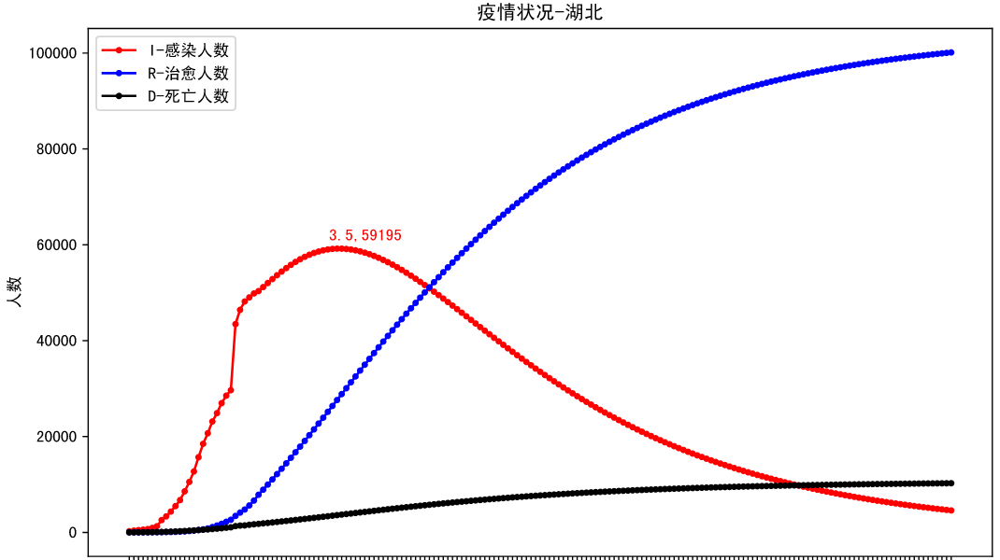
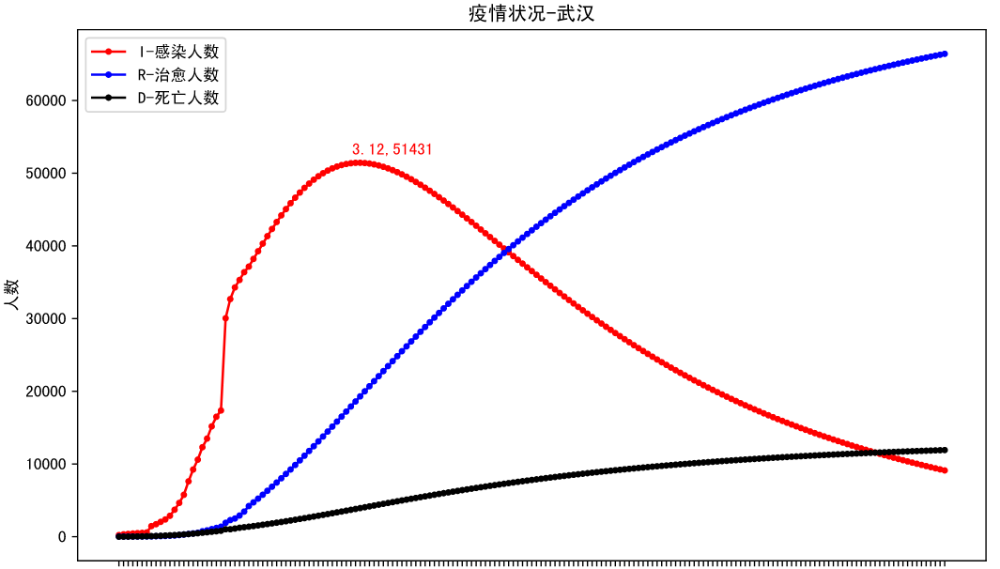
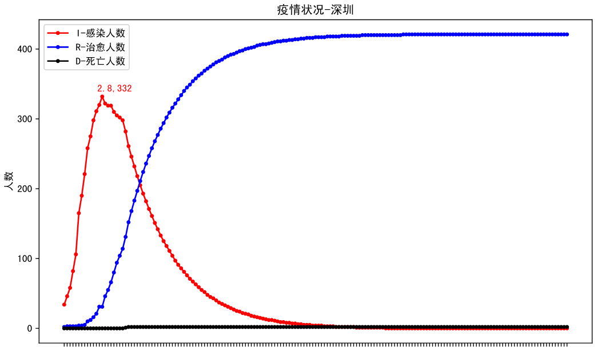
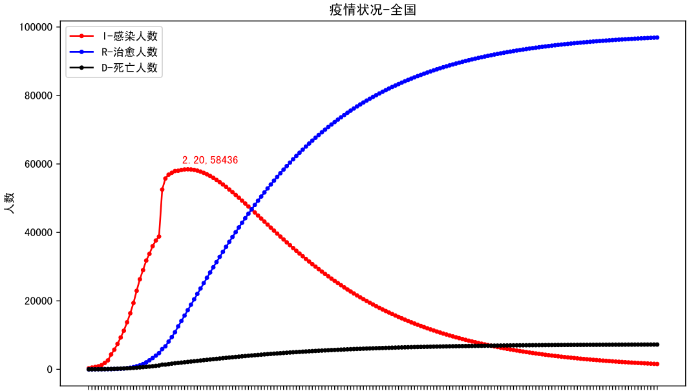
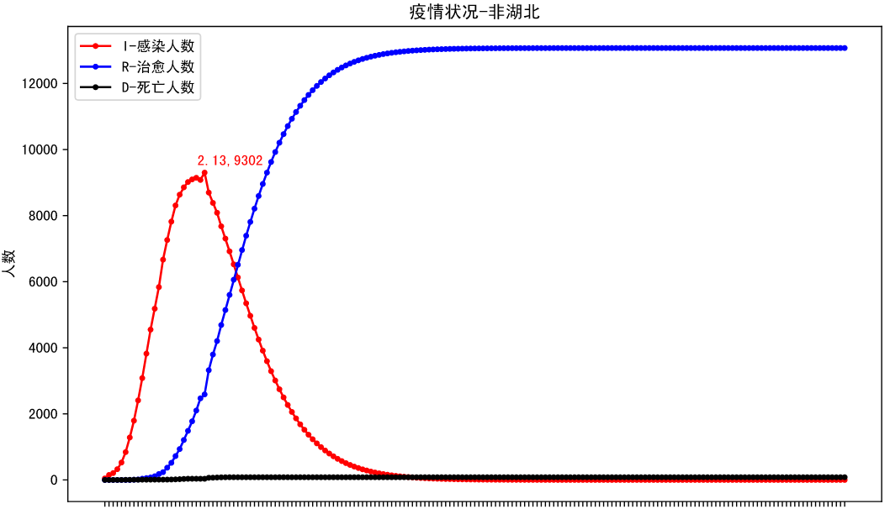
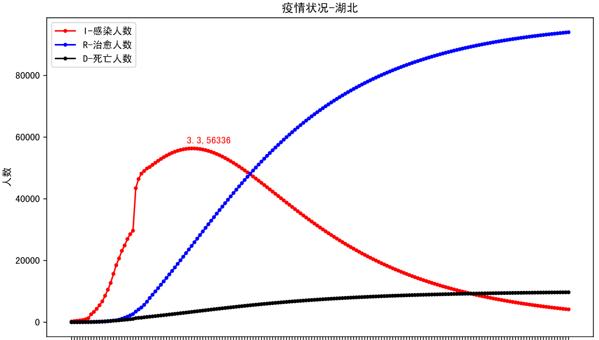
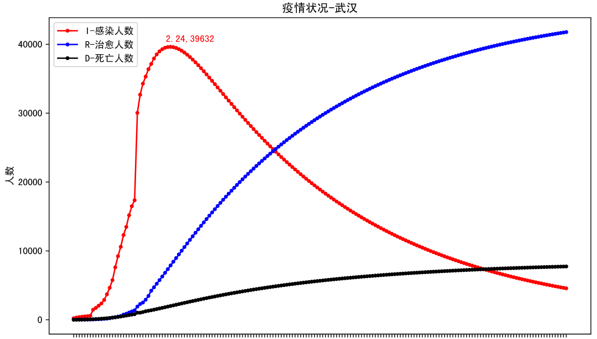
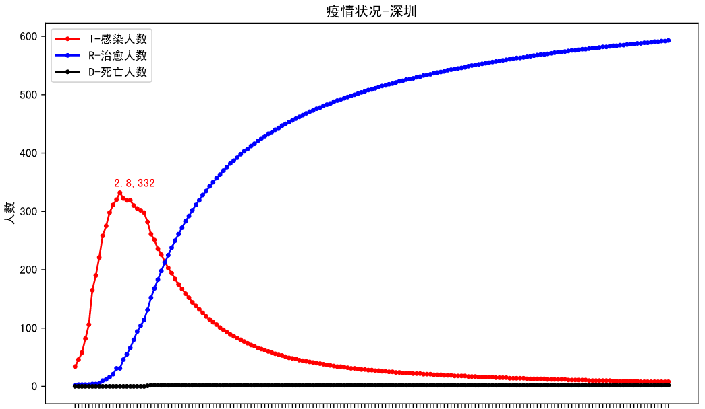
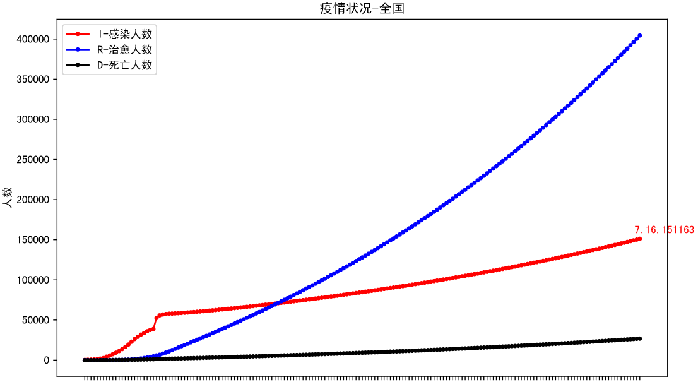
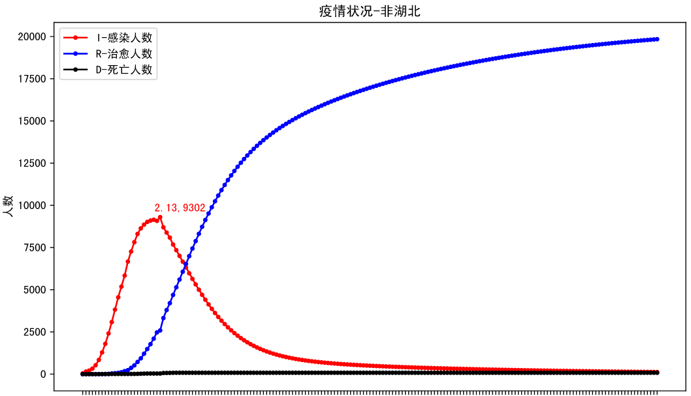

# 2019n-cov

## 方法：

实现了两种方法都是基于SEIRD模型的。

**SEIRD-exp-decay**：主要使用SEIRD模型，用梯度更新的方法学习其中的参数beta，gamma，alpha，theta，然后通过指数衰减的方法预测beta等参数的变化。

**SEIRD-ARIMA**：主要使用SEIRD模型，用梯度更新的方法学习其中的参数beta，gamma，alpha，theta，然后通过arima的方法预测beta等参数的变化。

### 拐点预测

基于2020-2-17号公布的数据

|                 | 湖北  | 武汉  | 深圳  | 全国     | 非湖北 |
| :-------------: | ----- | ----- | ----- | -------- | ------ |
| SEIRD-exp-decay | 03-05 | 03-12 | 02-08 | 02-20    | 02-13  |
|   SEIRD-ARIMA   | 03-03 | 02-24 | 02-08 | 无法预测 | 02-13  |

#### SEIRD-exp-decay：

#### SEIRD-ARIMA

